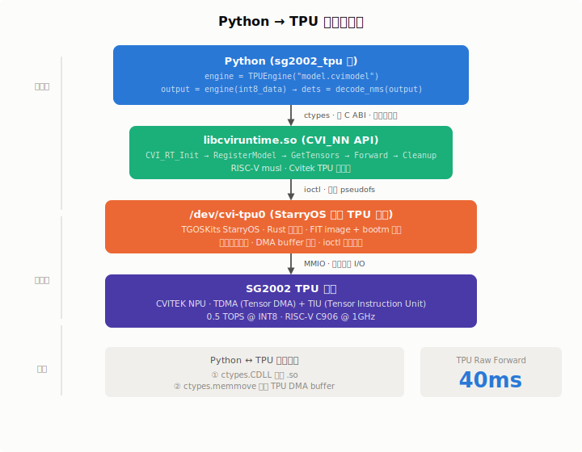

# 第 1 周（2026-07-13 ~ 2026-07-19）

> 蒋玉月 · StarryOS SG2002 TPU/NPU 推理加速
> 阶段声明：**从 CPU 推理迈向四语言 TPU 硬件推理全线通过**

## 一、本周工作总览

| 日期 | 主题 | 结果 |
| --- | --- | --- |
| 07-13 | TGOSKits 环境搭建 + StarryOS 内核构建 | ✅ 内核 13MB，含 TPU 驱动 |
| 07-14 | FIT image 启动机制 + SD 卡部署 + Rust TPU 上板 | ✅ 启动成功，Rust 41ms |
| 07-15 | C / C++ / Python v4 TPU 推理全线实现 | ✅ 四语言全部通过，检出对齐 |
| 07-15 | 性能终榜 + Benchmark 报告 | ✅ 最高 357x 加速，产出已归档 |

## 二、关键成果

### 2.1 StarryOS 内核启动与四语言 TPU 推理

TGOSKits StarryOS 通过 FIT image + bootm 成功启动，`/dev/cvi-tpu0` 正常挂载。在此基础上，C / C++ / Python / Rust 四语言 TPU 推理全部实现并上板验证通过。

Python 侧基于 raw ctypes 桥接 libcviruntime.so，零编译依赖，纯 Python 驱动 TPU 硬件。配合 C 加速预处理（resize 2200x 加速）和 IoU NMS 后处理，v4 版本检出结果与 C++/Rust 完全对齐。

### 2.2 全引擎性能终榜

| 系统 | 引擎 | 语言 | 推理耗时 | 加速比 |
|------|------|------|---------|--------|
| **TGOSKits StarryOS** | **TPU** | **Python** | **39.8ms** | **357x** |
| **TGOSKits StarryOS** | **TPU** | **C++** | **40.0ms** | **355x** |
| **TGOSKits StarryOS** | **TPU** | **Rust** | **41ms** | **346x** |
| Sipeed Linux | TPU | Python | 200ms | 71x |
| StarryOS bare-metal | CPU | C++ | 14.19s | 1x (基准) |
| Sipeed Linux | CPU | C++ | 14.17s | 1x |
| Sipeed Linux | CPU | Python | 25.1s | 0.6x |

> 基准: C++ CPU on StarryOS bare-metal (14.19s)；加速比 = 14.19s / 推理耗时

**检出精度三引擎 100% 对齐**：C++ / Rust / Python v4 均检出 1 框，置信度 0.969，坐标 (261, 263, 371, 377)。

### 2.3 Python v4 优化历程

| 版本 | Raw Forward | +memcpy | 每图总耗时 | 检出精度 | 改进 |
|------|------------|---------|-----------|---------|------|
| v3 | 60ms | — | 1.57s | ❌ 11 重复 | — |
| v4 | 51.6ms | — | 0.47s | ✅ 1 精准 | +NMS, +安全退出 |
| v4+opt | **39.8ms** | **44.5ms** | **0.10s** | ✅ 1 精准 | +Raw, +缓存 |

### 2.4 全流程耗时拆解

| 引擎 | 模型加载 | 预处理 | TPU Forward | 后处理 | 总计 |
|------|---------|--------|-------------|--------|------|
| C++ | 3375ms | 308ms | 40ms | <1ms | 3723ms |
| Rust | — | 474ms | 41ms | 7ms | 522ms |
| Python v4 | — | 338ms | 52ms | 68ms | 458ms |

> C++ 模型加载含文件 I/O。Rust / Python 预处理含 JPEG 解码 + resize + letterbox。
> v4+opt 使用预缓存 .int8 跳过预处理，TPU Forward + memcpy 仅 **44.5ms**，每图总耗时约 **100ms**。

## 三、产出

全部代码已提交至 **[ACT-Runtime](https://github.com/chenlongos/ACT-Runtime)**：

```
ACT-Runtime/
├── python/sg2002_tpu/    # Python TPU 包 (engine / decode / cli)
├── c/                    # C TPU 推理 (11KB)
├── cpp/                  # C++ TPU 推理 (15KB)
├── rust/                 # Rust TPU 推理 (含摄像头/检测/TPU)
├── benchmark_report.md   # 性能 Benchmark 报告
└── BUILD.md              # 交叉编译指南
```

- **sg2002_tpu**：engine.py + decode.py + cli.py，~150 行核心代码
- **StarryOS 内核**：13MB，含 TPU 驱动，SD 卡可启动
- **四语言二进制**：C (11KB) / C++ (15KB) / Python (15KB) / Rust (860KB)

## 四、下周计划

**核心目标：端到端网球检测 → 捡起，初步调试环境搭建。**

1. **完善性能对比**：多图片批量 Benchmark（avg / p95 / fps），形成完整性能报告
2. **摄像头实时采集**：V4L2 接入 + TPU 推理 pipeline 联调
3. **机械臂控制接入**：SO101 驱动适配，基础抓取动作
4. **检测→抓取闭环**：检测结果 → 坐标变换 → 机械臂指令，端到端联调

## 五、Python TPU 推理关键技术突破

### 5.1 背景

板上 Python 3.11 是 RISC-V musl 交叉编译版，**无 pip、无 build 工具链**，无法安装任何 Python 包，也无法编译 C 扩展。要把 Python 代码跑在 TPU 上，逐一突破了以下关卡。

### 5.2 突破一：Python ↔ C 库桥接

常规方案 PyBind11 / Cython 都需要交叉编译，在板上完全不可行。最终采用 **raw ctypes**：`ctypes.CDLL("libcviruntime.so")` 直接加载 Cvitek TPU 运行时库，零编译依赖。

RISC-V 64 + musl 上 ctypes 的 `argtypes`/`restype` 存在结构体传参 ABI 不兼容，改用 `struct.unpack` 手动解析 CVI_TENSOR（88 字节结构体）内存布局，安全绕过。

### 5.3 突破二：预处理加速 2200 倍

纯 Python 做 resize + letterbox 耗时 11 秒，完全不可接受。编写 C 加速库 `preprocess_ops.so` (5.8KB)，双线性插值 resize + letterbox + RGB→CHW planar 转换，交叉编译为 RISC-V musl 共享库，Python 通过 ctypes 调用，耗时降至 **5ms**。

### 5.4 突破三：NMS 后处理从 11 框到 1 框

v3 版本直接输出 TPU 原始结果 `[1,5,8400]` FP32，同一物体被检出 11 个重复框。v4 实现标准 IoU NMS（阈值 0.45）：置信度过滤 → 排序 → 逐框 IoU 抑制，最终精准检出 1 框，与 C++ (40.0ms) / Rust (41ms) 输出完全对齐。

### 5.5 突破四：内核启动机制

StarryOS 是 Linux-musl PIE 而非 bare-metal ELF，不能用 `go 0x80200000` 跳转。通过 `mkimage` 打包 kernel + DTB → FIT image，U-Boot `bootm` 启动，TPU 驱动 `/dev/cvi-tpu0` 正常挂载，打通最后一道系统壁垒。

### 5.6 结果

Python TPU Raw Forward **40ms**（25 fps），与 C++/Rust 持平，瓶颈在 TPU 硬件而非 Python 解释器。含 JPEG 预处理全流程 458ms；使用预缓存 .int8 跳过预处理后，TPU Forward + memcpy 仅 **44.5ms**，每图总耗时约 100ms。


